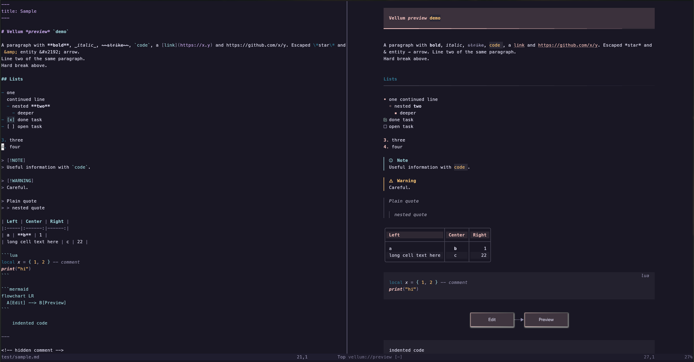

# vellum.nvim

A live markdown preview that renders beside your buffer, inside the terminal. GitHub-flavored markdown, with mermaid diagrams as real images.



- **Live.** Every keystroke re-renders. Unchanged blocks come from a cache, so it stays instant on long documents.
- **Follows you.** The preview scrolls with your cursor.
- **Looks like a document.** Heading bands with gradient edges, syntax-highlighted code panels, rounded tables with zebra rows, GitHub alerts, task lists. The colors come from your colorscheme.
- **Real diagrams.** Mermaid renders in a headless browser, exactly like GitHub, sized to match your terminal font. Each diagram renders once and is cached on disk.

## Requirements

- Neovim ≥ 0.12 with `termguicolors`
- Node.js ≥ 20 (only for mermaid diagrams)
- For images: [kitty](https://sw.kovidgoyal.net/kitty/) or [Ghostty](https://ghostty.org). In tmux, add `set -g allow-passthrough on`.
- A [Nerd Font](https://www.nerdfonts.com) for the alert and checkbox icons

## Install

With [lazy.nvim](https://github.com/folke/lazy.nvim):

```lua
{
  'blackhat-7/vellum.nvim',
  ft = 'markdown',
  keys = { { '<leader>mp', '<cmd>Vellum<cr>', desc = 'Markdown preview' } },
  opts = {},
}
```

lazy runs `build.lua` on install. It installs the diagram renderer: `npm ci` and a small headless Chrome download.

## Use

`:Vellum` toggles the preview. `q` in the preview closes it.

Options (the defaults):

```lua
require('vellum').setup({
  max_width = 100, -- widest text column in the preview
})
```

## Supported

| Markdown | Rendering |
|---|---|
| Headings | H1 band, H2 rule, colored levels |
| Emphasis, strike, `code`, links, bare URLs | styled inline |
| Lists, task lists, ordered lists | bullets per depth, checkboxes |
| Quotes and `> [!NOTE]` alerts | colored bar and title |
| Tables | aligned, wrapped to fit, zebra rows |
| Fenced code | tree-sitter syntax colors, language label |
| ` ```mermaid ` | image (text fallback outside kitty/Ghostty) |
| Local PNG images | image |
| Front matter, HTML blocks | shown as YAML / text; comments hidden |

## License

MIT
