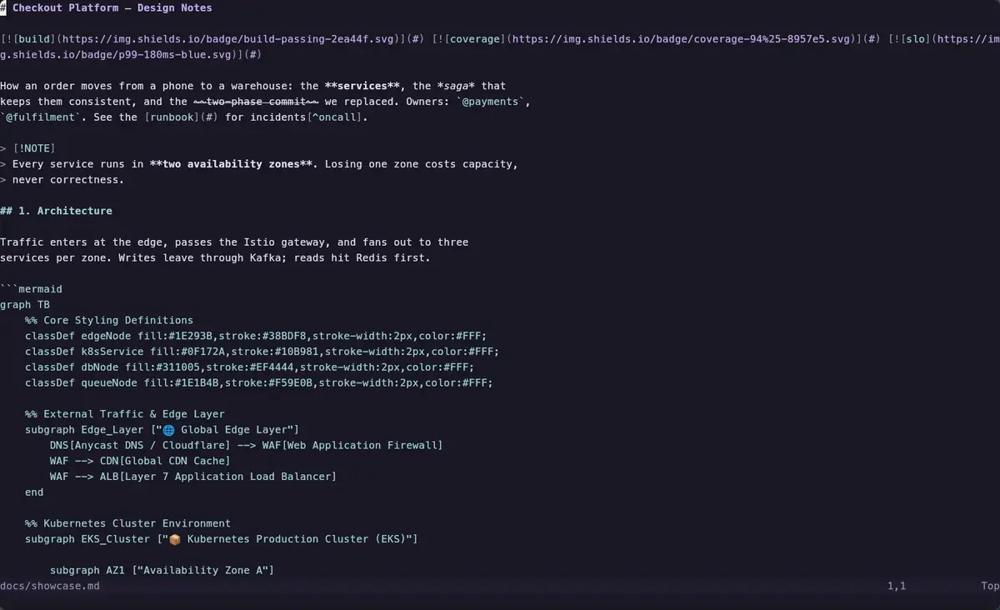
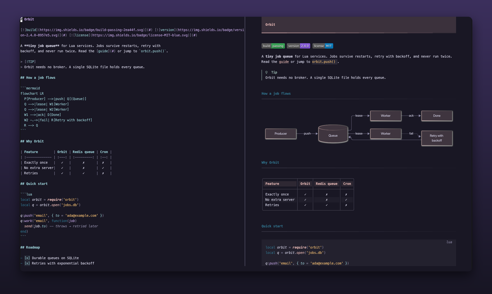
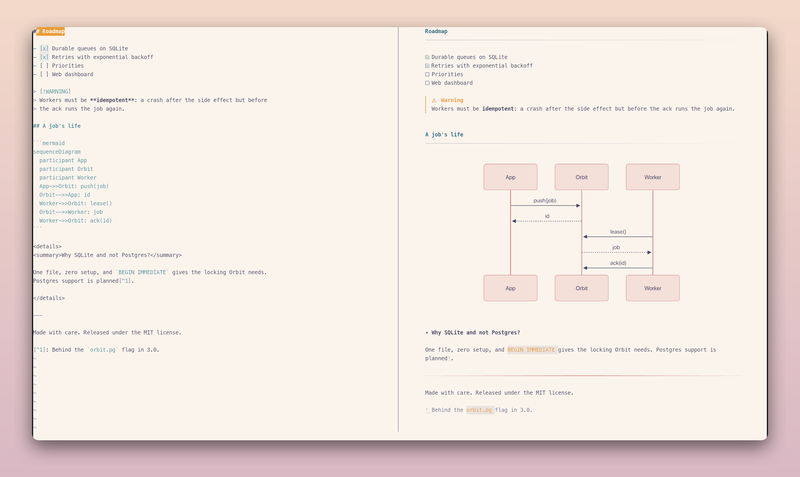
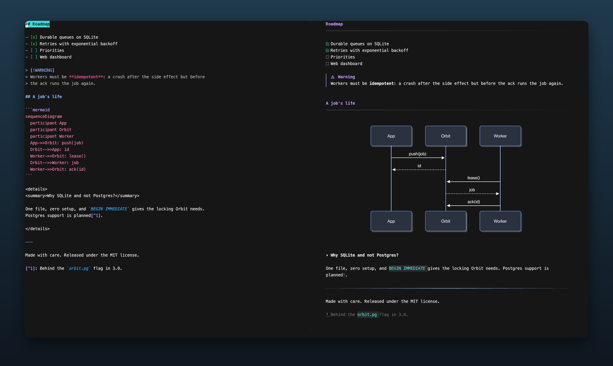

# vellum.nvim

A live markdown preview that renders beside your buffer, inside the terminal. GitHub-flavored markdown, with mermaid diagrams as real images.



- **Live.** Every keystroke re-renders. Unchanged blocks come from a cache, so it stays instant on long documents.
- **Follows you.** The preview scrolls with your cursor.
- **Looks like a document.** Heading bands with gradient edges, syntax-highlighted code panels, rounded tables with zebra rows, GitHub alerts, task lists, `<details>` blocks. Badges sit inline, like on GitHub. The colors come from your colorscheme.
- **Real diagrams.** Mermaid renders in a headless browser, exactly like GitHub, sized to match your terminal font. Each diagram renders once and is cached on disk (capped at 100 MB).



Colors follow your colorscheme, light or dark, diagrams included:

<p>
  
  
</p>

## Requirements

- Neovim ≥ 0.12 with `termguicolors`
- Node.js ≥ 20 (for mermaid diagrams and non-PNG images)
- For images: [kitty](https://sw.kovidgoyal.net/kitty/) or [Ghostty](https://ghostty.org). Works over ssh. In tmux, add:
  ```tmux
  set -g allow-passthrough on
  set -as terminal-features ',xterm-256color:RGB'   # your outer $TERM; ssh drops COLORTERM
  ```
- A [Nerd Font](https://www.nerdfonts.com) for the alert and checkbox icons

## Install

With [lazy.nvim](https://github.com/folke/lazy.nvim):

```lua
{
  'blackhat-7/vellum.nvim',
  ft = 'markdown',
  keys = { { '<leader>mp', '<cmd>Vellum<cr>', desc = 'Markdown preview' } },
  opts = {},
}
```

lazy runs `build.lua` on install. It installs the diagram renderer: `npm ci` and a small headless Chrome download.

## Use

`:Vellum` toggles the preview. `q` in the preview closes it.

`<CR>` on a diagram or image in the preview opens it full-screen: `+`/`-` zoom (or Ctrl+wheel, toward the pointer), `hjkl` or the mouse wheel pan, `0` fits, `q` closes. To zoom from the markdown buffer, map `require('vellum').zoom()`; it opens the image beside your cursor.

Options (the defaults):

```lua
require('vellum').setup({
  max_width = 100, -- widest text column in the preview
})
```

## Supported

| Markdown | Rendering |
|---|---|
| Headings | H1 band, H2 rule, colored levels |
| Emphasis, strike, `code`, links, bare URLs | styled inline |
| Lists, task lists, ordered lists | bullets per depth, checkboxes |
| Quotes and `> [!NOTE]` alerts | colored bar and title |
| Tables | aligned, wrapped to fit, zebra rows |
| Fenced code | tree-sitter syntax colors, language label |
| ` ```mermaid ` | image (text fallback outside kitty/Ghostty) |
| Footnotes | superscript refs, muted notes |
| Math: `$…$`, `$$…$$`, ` ```math ` | inline as Unicode text (`x²`, `α ≤ β`); display math as a KaTeX image (Unicode text elsewhere) |
| Images: PNG, JPG, GIF, WebP, SVG, local or http(s) | image (alt text elsewhere) |
| Front matter, HTML blocks | shown as YAML / text; comments hidden |

## License

MIT
