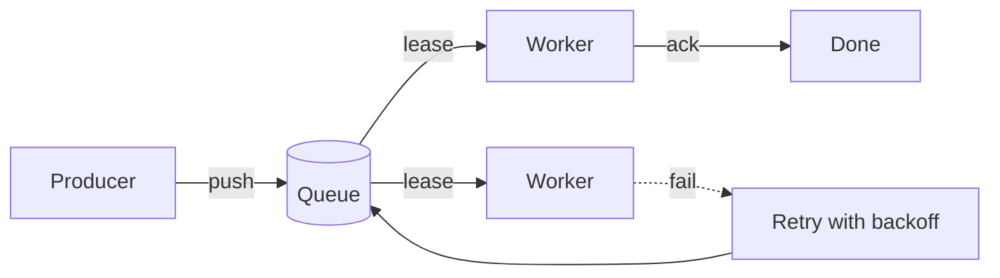
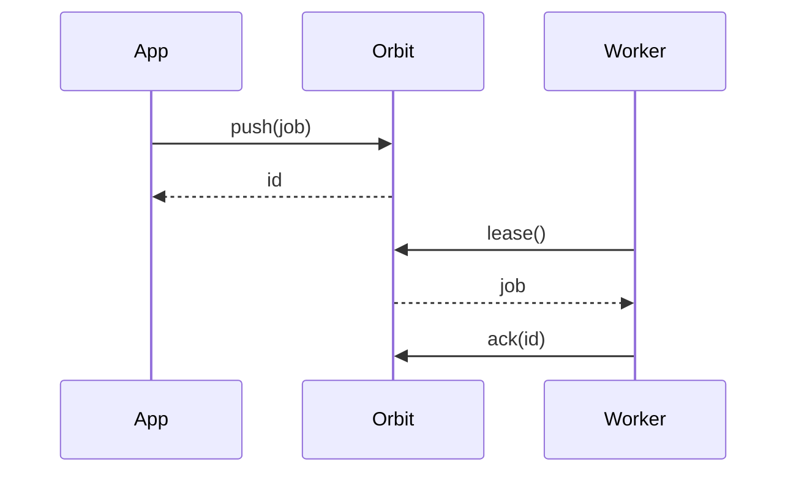

# Orbit

[](#) [](#) [](#)

A **tiny job queue** for Lua services. Jobs survive restarts, retry with
backoff, and never run twice. Read the [guide](#) or jump to `orbit.push()`.

> [!TIP]
> Orbit needs no broker. A single SQLite file holds every queue.

## How a job flows



## Why Orbit

| Feature        | Orbit | Redis queue | Cron |
| :------------- | :---: | :---------: | :--: |
| Exactly once   |   ✓   |      ✗      |  ✗   |
| No extra server|   ✓   |      ✗      |  ✓   |
| Retries        |   ✓   |      ✓      |  ✗   |

## Quick start

```lua
local orbit = require('orbit')
local q = orbit.open('jobs.db')

q:push('email', { to = 'ada@example.com' })
q:work('email', function(job)
  send(job.to) -- throws → retried later
end)
```

## Backoff

Retry $n$ waits $d_0 \cdot 2^n$ seconds, capped at an hour:

$$
d_n = \min\left(3600,\; d_0 \cdot 2^{n}\right)
$$

## Roadmap

- [x] Durable queues on SQLite
- [x] Retries with exponential backoff
- [ ] Priorities
- [ ] Web dashboard

> [!WARNING]
> Workers must be **idempotent**: a crash after the side effect but before
> the ack runs the job again.

## A job's life



<details>
<summary>Why SQLite and not Postgres?</summary>

One file, zero setup, and `BEGIN IMMEDIATE` gives the locking Orbit needs.
Postgres support is planned[^1].

</details>

---

Made with care. Released under the MIT license.

[^1]: Behind the `orbit.pg` flag in 3.0.
