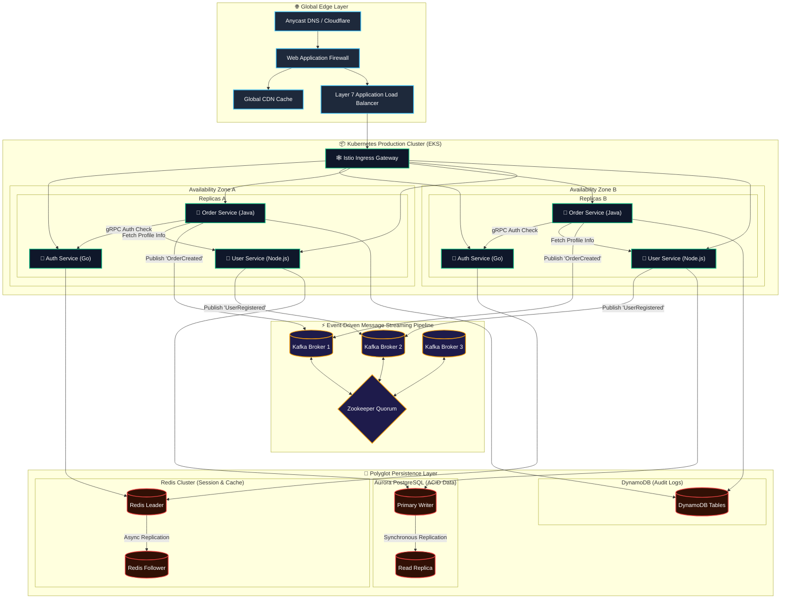
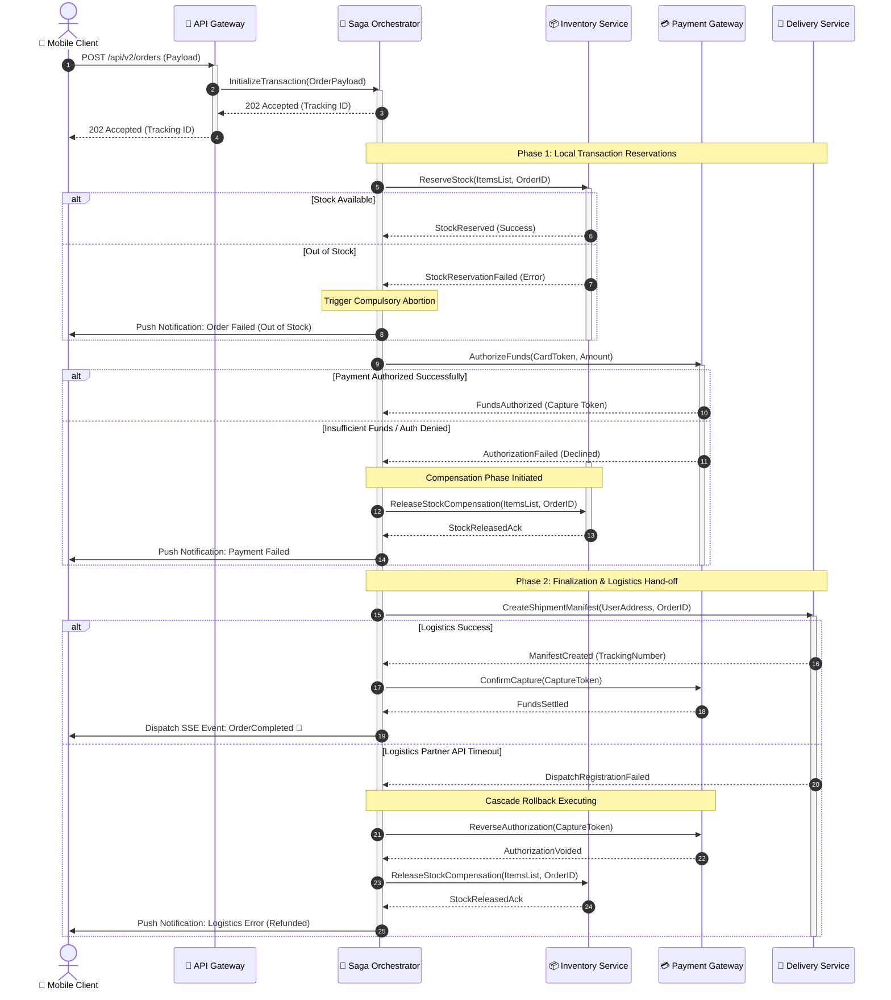
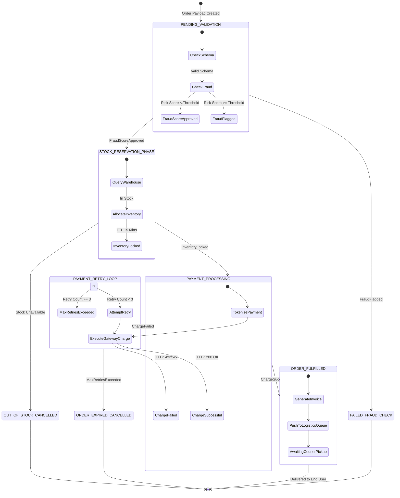

# Checkout Platform — Design Notes

[](#) [](#) [](#)

How an order moves from a phone to a warehouse: the **services**, the *saga* that
keeps them consistent, and the ~~two-phase commit~~ we replaced. Owners: `@payments`,
`@fulfilment`. See the [runbook](#) for incidents[^oncall].

> [!NOTE]
> Every service runs in **two availability zones**. Losing one zone costs capacity,
> never correctness.

## 1. Architecture

Traffic enters at the edge, passes the Istio gateway, and fans out to three
services per zone. Writes leave through Kafka; reads hit Redis first.



| Tier      | Tech               | Replicas | p99 budget | Owner        |
| :-------- | :----------------- | -------: | ---------: | :----------- |
| Edge      | Cloudflare, ALB    |        — |      12 ms | `@platform`  |
| Services  | Go, Java, Node.js  |        6 |      90 ms | `@checkout`  |
| Streaming | Kafka ×3           |        3 |      25 ms | `@data`      |
| Storage   | Aurora, Redis, DDB |        5 |      40 ms | `@storage`   |

## 2. Capacity model

Each service is an $M/M/c$ queue. With arrival rate $\lambda$ and service rate
$\mu$ per pod, utilisation is $\rho = \lambda / (c\mu)$ and must stay below $0.7$.
Little's law, $L = \lambda W$, turns the latency budget into a queue-depth alarm.

$$
W = \frac{1}{\mu} + \frac{C(c, \lambda/\mu)}{c\mu - \lambda},
\qquad
C(c, a) = \frac{\dfrac{a^c}{c!}\,\dfrac{c}{c - a}}{\displaystyle\sum_{k=0}^{c-1} \frac{a^k}{k!} + \frac{a^c}{c!}\,\frac{c}{c - a}}
$$

Two zones with availability $a_i$ fail only together:

```math
\begin{aligned}
A_{\text{region}} &= 1 - \prod_{i=1}^{2} \left(1 - a_i\right) \\
                  &= 1 - (1 - 0.999)^2 = 0.999999
\end{aligned}
```

Retries back off exponentially with full jitter, where $n$ is the attempt:

$$
d_n \sim \mathcal{U}\!\left(0,\; \min\left(d_{\max},\, d_0 \cdot 2^{n}\right)\right),
\qquad
\mathbb{E}[d_n] = \tfrac{1}{2}\min\left(d_{\max},\, d_0 2^{n}\right)
$$

## 3. Checkout saga

No distributed lock, no two-phase commit. The orchestrator runs local steps and
undoes finished ones with **compensations** when a later step fails.



> [!WARNING]
> Compensations must be **idempotent**. The orchestrator retries them after a crash,
> so `ReleaseStock` may run twice for one order.

Step failure rates compound. With per-step failure $p_k$:

$$
P(\text{rollback}) = 1 - \prod_{k=1}^{3} (1 - p_k) \approx \sum_{k=1}^{3} p_k
\quad \text{when } p_k \ll 1
$$

```go
func (s *Saga) Run(ctx context.Context, o Order) error {
	for i, step := range s.steps {
		if err := step.Do(ctx, o); err != nil {
			for j := i - 1; j >= 0; j-- {
				s.steps[j].Undo(ctx, o) // idempotent, retried on crash
			}
			return fmt.Errorf("step %s: %w", step.Name, err)
		}
	}
	return nil
}
```

## 4. Order state machine



The retry loop is bounded. An order leaves `PAYMENT_RETRY_LOOP` after at most
three attempts, so every path reaches a terminal state:

$$
T_{\text{worst}} = \sum_{n=0}^{2} d_n + 3\,t_{\text{charge}} \le 3\,(d_{\max} + t_{\text{charge}})
$$

## Rollout

1. Shadow traffic
   - mirror 1% of checkouts to the saga path
   - compare outcomes with the old flow
2. Canary in **zone A**, then zone B
3. Remove the two-phase commit code

- [x] Saga orchestrator
- [x] Idempotent compensations
- [ ] Chaos test: kill a zone mid-checkout
- [ ] Remove `legacy-2pc`

> [!IMPORTANT]
> Freeze deploys during the canary. A rollback must not race a schema migration.

<details>
<summary>Why not two-phase commit?</summary>

2PC holds locks across services while the coordinator waits. One slow payment
gateway would stall inventory for every order. The saga trades that for eventual
consistency, bounded by the retry budget above.

</details>

---

[^oncall]: Pager rotation: `@checkout-oncall`, 24/7.
