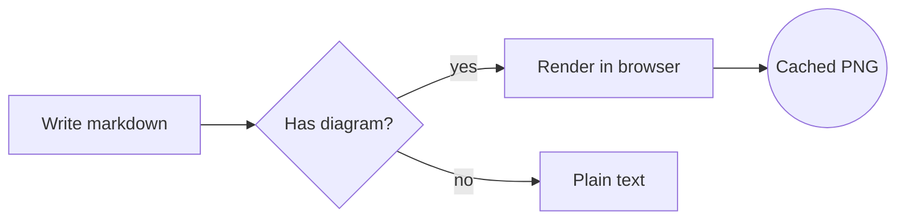
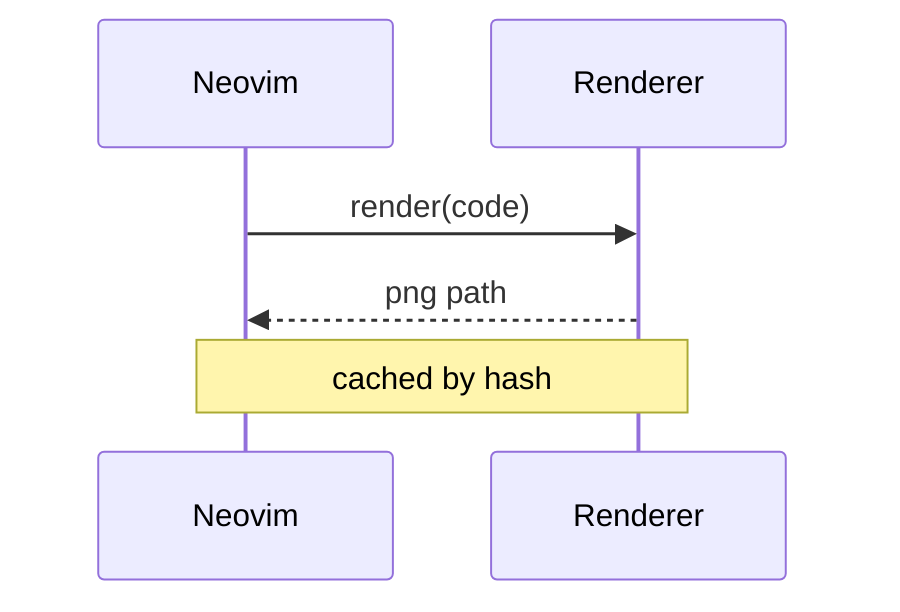
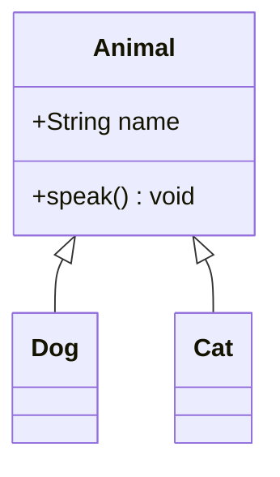
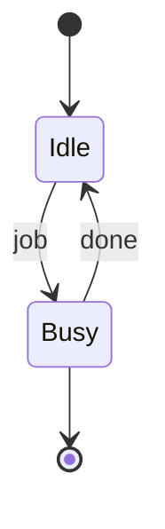
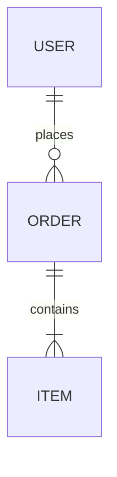
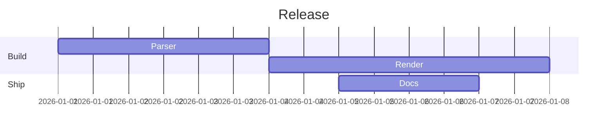
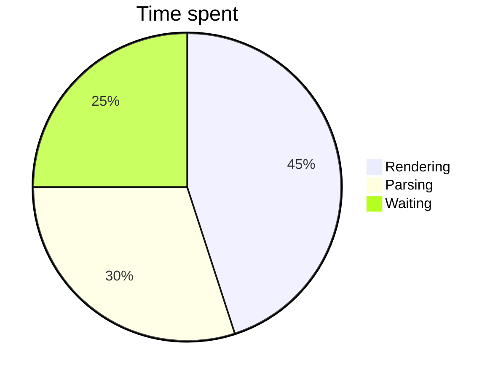
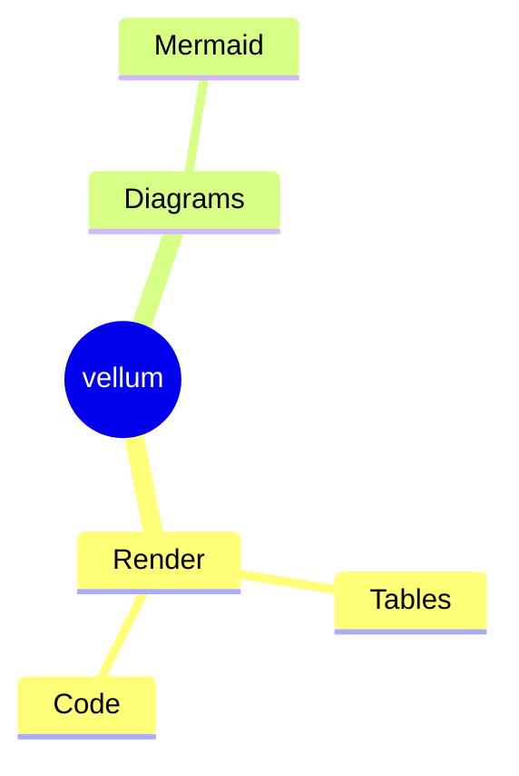
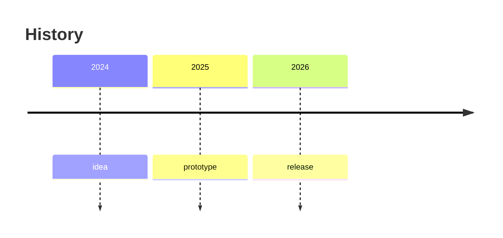
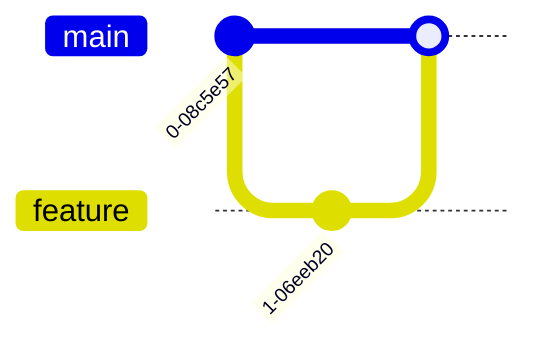

# Diagrams

```mermaid
flowchart LR
  A[Write markdown] --> B{Has diagram?}
  B -->|yes| C[Render in browser]
  B -->|no| D[Plain text]
  C --> E((Cached PNG))
```

```mermaid
sequenceDiagram
  participant N as Neovim
  participant R as Renderer
  N->>R: render(code)
  R-->>N: png path
  Note over N,R: cached by hash
```

```mermaid
classDiagram
  class Animal {
    +String name
    +speak() void
  }
  Animal <|-- Dog
  Animal <|-- Cat
```

```mermaid
stateDiagram-v2
  [*] --> Idle
  Idle --> Busy: job
  Busy --> Idle: done
  Busy --> [*]
```

```mermaid
erDiagram
  USER ||--o{ ORDER : places
  ORDER ||--|{ ITEM : contains
```

```mermaid
gantt
  title Release
  dateFormat YYYY-MM-DD
  section Build
  Parser :a1, 2026-01-01, 3d
  Render :after a1, 4d
  section Ship
  Docs   :2026-01-05, 2d
```

```mermaid
pie title Time spent
  "Rendering" : 45
  "Parsing" : 30
  "Waiting" : 25
```

```mermaid
mindmap
  root((vellum))
    Render
      Tables
      Code
    Diagrams
      Mermaid
```

```mermaid
timeline
  title History
  2024 : idea
  2025 : prototype
  2026 : release
```

```mermaid
gitGraph
  commit
  branch feature
  commit
  checkout main
  merge feature
```

```mermaid
flowchart LR
  A --> 
```
