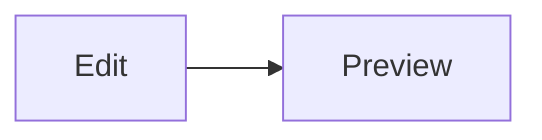

# Vellum *preview* `demo`

A paragraph with **bold**, _italic_, ~~strike~~, `code`, a [link](https://x.y) and https://github.com/x/y. Escaped \*star\* and &amp; entity &#x2192; arrow.
Line two of the same paragraph.  
Hard break above.

## Lists

- one
  continued line
  - nested **two**
    - deeper
- [x] done task
- [ ] open task

3. three
4. four

> [!NOTE]
> Useful information with `code`.

> [!WARNING]
> Careful.

> Plain quote
> > nested quote

| Left | Center | Right |
|:-----|:------:|------:|
| a | **b** | 1 |
| long cell text here | c | 22 |

```lua
local x = { 1, 2 } -- comment
print("hi")
```



    indented code

---

<!-- hidden comment -->
<p align="center">centered html</p>

### Level 3
#### Level 4
##### Level 5
###### Level 6
